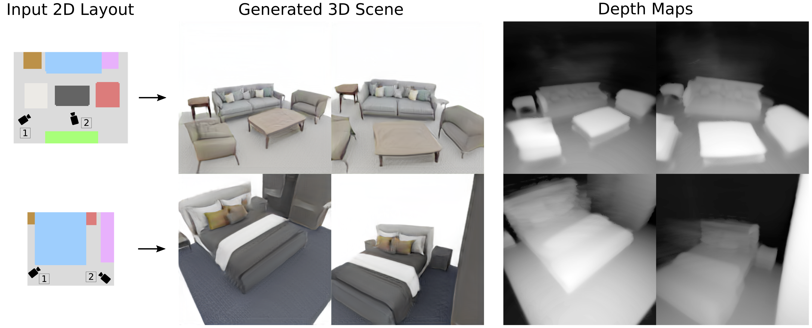

# CC3D: Layout-Conditioned Generation of Compositional 3D Scenes</sub>



**CC3D: Layout-Conditioned Generation of Compositional 3D Scenes**<br>
### [Project Page](https://sherwinbahmani.github.io/cc3d) | [Paper](https://arxiv.org/abs/2303.12074)<br>

Abstract: *In this work, we introduce CC3D, a conditional generative model that synthesizes complex 3D scenes conditioned on 2D semantic scene layouts, trained using single-view images. Different from most existing 3D GANs that limit their applicability to aligned single objects, we focus on generating complex scenes with multiple objects, by modeling the compositional nature of 3D scenes. By devising a 2D layout-based approach for 3D synthesis and implementing a new 3D field representation with a stronger geometric inductive bias, we have created a 3D GAN that is both efficient and of high quality, while allowing for a more controllable generation process. Our evaluations on synthetic 3D-FRONT and real-world KITTI-360 datasets demonstrate that our model generates scenes of improved visual and geometric quality in comparison to previous works.*

## Requirements
The codebase is tested on 
* Python 3.9
* PyTorch 1.12.1
* 4 NVIDIA GPUs (Tesla V100 32GB) with CUDA version 11.6

For additional python libraries, please install by:

```
pip install -r requirements.txt
```

Please refer to https://github.com/NVlabs/stylegan2-ada-pytorch for additional software/hardware requirements.

## Dataset
Datasets need to have two subdirectories, namely images and labels. In each there are given number of scenes with renderings in images and labels in the dedicated boxes.npz. boxes.npz stores the layout parameters and the camera parameters. We use [BlenderProc](https://github.com/DLR-RM/BlenderProc/tree/main/examples/datasets/front_3d_with_improved_mat) to render the 3D-FRONT dataset. We provide pre-processing repositories here:

- [3D-FRONT](https://github.com/sherwinbahmani/threed_front_rendering) 
- [KITTI-360](https://github.com/QhelDIV/kitti360_renderer)

<pre>
dataset/ 
        images/
                scene_x/[0.png, ..., max_num.png]
        labels/
                scene_x/boxes.npz
</pre>
## Pre-trained Checkpoints
You can download the pre-trained checkpoints used in our paper:
| Dataset   | Resolution |                           Download                           |
| :-------- | :--------: | :----------------------------------------------------------: |
| 3D-FRONT Bedrooms      |    256     |  [Google Drive](https://drive.google.com/file/d/1s7cXYEwW9ij7id718QAR_2XmU_yLQN1W) |
| 3D-FRONT Living Rooms    |    256     |  [Google Drive](https://drive.google.com/file/d/1eJgE47r5CcLkpk6lKZg1LQ03G9euPyDC) |
| KITTI-360      |    256     |  [Google Drive](https://drive.google.com/file/d/1j6KmjuK0ussmM_Y3WxCxbZ0w0_XFWs9s) |

## Train a new model
```bash
bash train.sh
```

## Render scenes with a pre-trained model
```bash
bash generate.sh
```

## Evaluate model

Use ```evaluate.sh``` to evaluate a trained model for the FID metric.

## License

Our code is based on the [EG3D](https://github.com/NVlabs/eg3d) and follows their license code.
